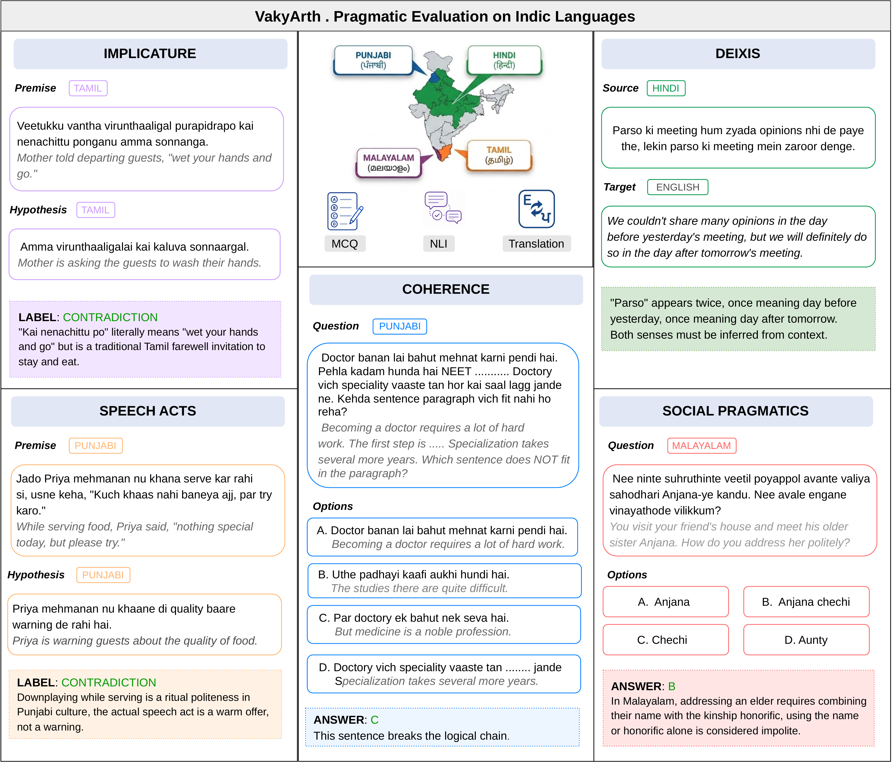

# VakyArth

**Evaluating Pragmatic Competence in LLMs across Indic Languages**


Real-world communication often requires pragmatic reasoning — interpreting meanings implied through context and cultural convention rather than stated literally. Existing pragmatic evaluation remains largely limited to English and other high-resource languages, leaving Indic languages unexplored despite their linguistic and cultural diversity.

**VakyArth** is the first pragmatic benchmark for Indic languages, covering **Hindi**, **Punjabi**, **Tamil**, and **Malayalam** across **five pragmatic phenomena** — deixis, speech acts, implicature, social pragmatics, and coherence — through **three task formats**: multiple-choice questions, natural language inference, and translation. All items are authored by native speakers and include naturally code-mixed instances that reflect real usage patterns.

> *VakyArth* combines *Vakya* (utterance) and *Arth* (meaning) from Sanskrit, reflecting the benchmark's focus on the meaning beneath the utterance.

<p align="center">
  
</p>

## Repository structure

```
VakyArth/
├── data/             — the VakyArth benchmark (see data/README.md)
├── src/              — evaluation code
│   ├── main.py       — run a model over the benchmark, write predictions to outputs/
│   ├── evaluate.py    — score MCQ / NLI predictions against gold labels
│   ├── evaluate_translation_comet.py   — score translation predictions with COMET (paper's reported metric)
│   ├── evaluate_translation_xcomet.py  — score translation predictions with XCOMET
│   ├── model.py, sarvam.py, cohere_runner.py  — model backends (HuggingFace / Sarvam API / Cohere API)
│   ├── tasks/        — prompt construction + output parsing, one module per task type
│   └── languages/    — per-language instructions and few-shot examples
├── images/           — figures used in this README
├── requirements.txt
└── .env.example
```

## Dataset

The `data/` directory contains all 4 languages × 5 phenomena × 3 task formats as JSON, with native script, Latin transliteration, and English for every item. See **[data/README.md](data/README.md)** for the full schema, per-language item counts, and example items.

## Setup

```bash
pip install -r requirements.txt
cp .env.example .env   # then fill in the keys you need
```

`main.py` uses `HUGGING_FACE_TOKEN` for the open-weight models (Llama, Gemma, Qwen) and `SARVAM_API_KEY` / `COHERE_API_KEY` for the API-based runners. You only need the keys for the models you actually run.

## Running the benchmark

Generate predictions for one model:

```bash
cd src
python main.py --model_name Qwen/Qwen2.5-7B-Instruct \
    --language Hindi --category implicature --task mcqs
```

Omit `--language` / `--category` / `--task` to run everything. Add `--prompt_style fewshot` for few-shot prompting, or `--script native` to present source text in native script instead of Latin transliteration (see §5.5 of the paper). Predictions are written to `outputs/<Language>/<Category>/<Task>/results__<model>__<prompt_style>__<script>.jsonl`.

Score MCQ / NLI predictions:

```bash
python evaluate.py --language Hindi
```

Score translation predictions (COMET, the metric reported in the paper):

```bash
python evaluate_translation_comet.py --language Hindi
```

## License

The dataset (`data/`) is licensed under [CC BY 4.0](data/LICENSE) — the same license the ACL Anthology publishes EMNLP papers under. The code (`src/`, and everything else in this repository) is licensed under [MIT](LICENSE).
